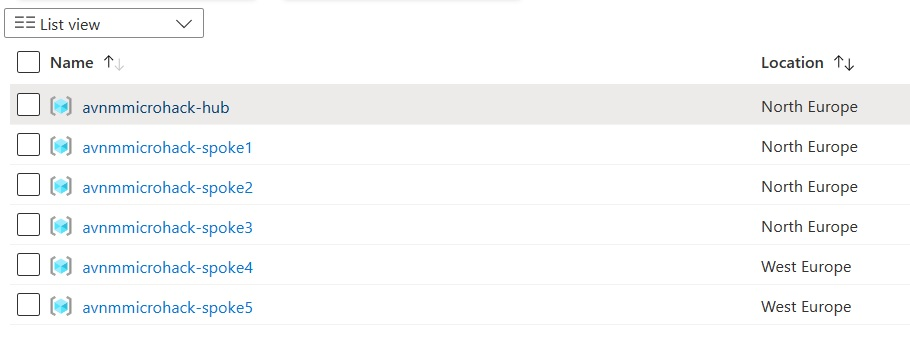

# Walkthrough Challenge 1 - Deployment of AVNM Micrhoack Landing Zone

Duration: 10 minutes

This walkthrough will walk you through the steps to deploy the AVN Microhack landing zone:

### Task 1 - Deploy the lab

You will use a predefined Terraform template to deploy the base environment. It will be deployed in to *your* Azure subscription. As stated the locations for this deployment will be in North- and West Europe. If you are experienced in Terraform (or coding) you can alter these in the *variables.tf* file in the parameters *location1* and *location2*.

To start the terraform deployment, follow the steps listed below:

- Login to Azure cloud shell [https://shell.azure.com/](https://shell.azure.com/)
- Ensure that you are operating within the correct subscription via (Azure CLI):

`az account show`

If you don't have the right subscription, select the right one with the following command:

`az account set --subscription <Name or ID of subscription>`

- Clone the following GitHub repository

`git clone https://github.com/aramsmith/avnm-microhack`

- Go to the new folder AVNM-Microhack

`cd ./AVNM-Microhack`

- Initialize the terraform modules and download the azurerm resource provider by typing the command:

`terraform init`

(If you have used Terraform before, make sure you run `terraform init -update` to initialize version 3.55 which is required as minimum for this microhack).

- Now run apply to start the deployment:

`terraform apply`

- Choose a suitable *password* to be used for your Virtual Machines administrator account.
- Remember the username is: ***AzureAdmin***
- When prompted, confirm with a **yes** to start the deployment
- Wait for the deployment to be completed. This will take around 10 minutes.

You can also deploy this through Visual Studio Code by pulling the git repository in your VS Code library and deploy it through the terminal.

### Task 2 - Verify

After the Terraform deployment concludes successfully, the following have been deployed into your subscription:

- 6 resource groups:
  - 1 Hub RG located in *North Europe* region, with A Vnet 10.10.0.0/16 2 subnets, a Virtual Machine and Azure Bastion.
  - 3 Spoke RG's, Spoke 1 to 3 located in *North Europe* region, with corresponding subnets 10.11.0.0/16, 10.12.0.0/16 and 10.13.0.0/16 each of them configured with a Virtual machine.
    - 2 Spoke RG's, Spoke 4 & 5 located in *West Europe* region with corresponding subnets 10.14.0.0/16 and 10.15.0.0/16
  - You can see that every VNet has a tag location:region (either northeurope or westeurope).
    - Verify that there are no peerings between the Hub and spokes or between spokes.

Verify these resources are present in the portal.
Layout should look like this:

Credentials are identical for all VMs, as follows:

- User name: **AzureAdmin**
- Password: *your password* that you have chosen in the deployment.

You successfully completed challenge 1! 🚀🚀🚀

You can now proceed with **[Challenge 2](../../README.md#challenge-2-create-network-groups)**
 
